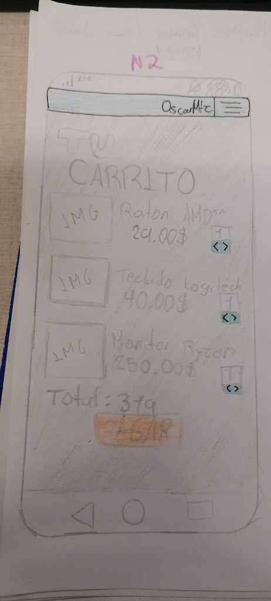
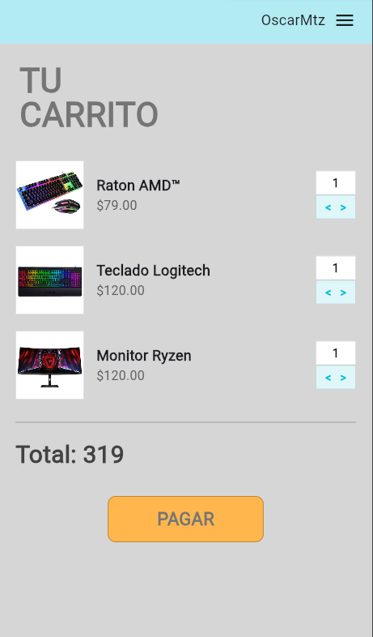

# myapp

##  Mi Prompt a la ia 
Crea una aplicación en Flutter para una sola página llamada CarritoPage que funcione perfectamente en DartPad sin errores de constantes u opacidad. El diseño debe tener un fondo de color gris sólido hexadecimal 0xFFD6D6D6. En la parte superior, coloca un Container azul pastel 0xFFB2EBF2 que abarque todo el ancho y contenga el texto 'OscarMtz' seguido de un icono de menú alineados a la derecha. Debajo de esta barra, añade un título con el texto 'TU\nCARRITO' en dos líneas, con un tamaño de fuente 42, negrita, color gris oscuro 0xFF757575 y un espaciado de línea de 1.0. Para la lista de productos, crea un método reutilizable que genere filas compuestas por: un contenedor blanco con borde fino de 85x85 que cargue una imagen desde una URL mediante Image.network, el nombre del producto en negrita, el precio en gris, y un selector de unidades a la derecha. Este selector de unidades debe ser vertical, compuesto por un cuadro blanco arriba con el número '1' y un cuadro azul claro 0xFFE0F7FA justo debajo que contenga los caracteres '<' y '>' ( ojo deben de ser en horizontal las flechas) en color cian negrita. La lista debe incluir tres productos: un 'Raton AMD™' con imagen de mouse gamer, un 'Teclado Logitech' y un 'Monitor Ryzen'. Al final de la lista, incluye un Divider gris, el texto( LADO IZQUIERDO) 'Total: 319' en tamaño 30 y un botón central de color naranja 0xFFFFB74D que diga 'PAGAR' en fuente 22, color gris oscuro, con bordes ligeramente redondeados y un borde fino exterior. Asegúrate de usar SafeArea y SingleChildScrollView para que el diseño sea responsivo y no use palabras clave const dentro del cuerpo del build para evitar errores de renderizado en la web. ( OJO TODO EN ESTO EN FILAS Y COLUMNAS). verifica que no tenga el error BoxCrop. Las imagenes que sean a corde de los productos(en teclado logitech(https://raw.githubusercontent.com/OscarinMtz/Ull_act2_cards/refs/heads/main/descarga%20(1).png), raton amd (https://raw.githubusercontent.com/OscarinMtz/Ull_act2_cards/refs/heads/main/descarga%20(2).png) y monitor ryzen usar esta imagen (https://raw.githubusercontent.com/OscarinMtz/Ull_act2_cards/refs/heads/main/descarga%20(1)%20(1).png)).

## Imagenes 

 ## web

